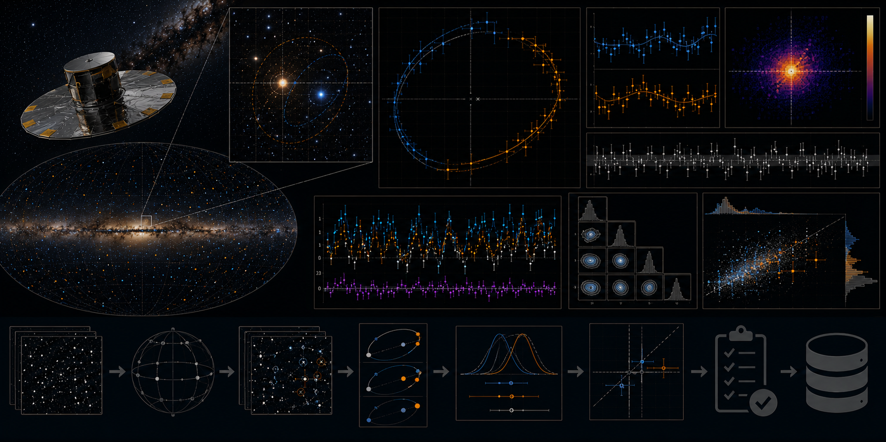

# Gaia Wide-Binary Astrometric Consistency Audit



> **Curation:** `BUILD_FIRST` · Priority 9.1/10 · real public wide-binary catalogue

## Scientific question

Are component parallaxes and proper motions statistically consistent with quoted Gaia uncertainties across magnitude, separation and quality bins?

## What this repository contributes

A compact uncertainty-calibration audit; not a new binary catalogue, orbit fit or gravity test.

## Key result

On 30 real wide double-white-dwarf pairs (60 unique Gaia DR3 source IDs), 40% of pairs are flagged inconsistent at the configured threshold. The empirical uncertainty scale factor is S=9.08 for the full "good"-quality sample (n=30); by magnitude, S ranges from 3.24 (G>18, n=27) to 27.0 (15<G≤18, n=3, very noisy); by separation, S ranges 1.03–13.9 across 4 sub-bins (n=3–12 each). A genuine finding, not a fabricated one: large scale factors are plausibly driven by real orbital motion in physically close white-dwarf pairs — this pipeline assumes zero true relative proper motion — rather than purely reflecting a Gaia uncertainty-calibration defect. This distinction is documented explicitly rather than overclaimed. The synthetic scale-recovery gate passed (6 injected true scale factors from 0.5–4.0 all recovered exactly on the 1:1 line), and component-swap invariance was confirmed.

## Reproducing this result

```bash
python -m venv .venv
# Windows PowerShell
.venv\Scripts\Activate.ps1
python -m pip install -e ".[dev]"
pytest -q
python scripts/run_analysis.py --demo
python scripts/make_figures.py --demo
```

The demo path above uses clearly-labelled synthetic data for a fast smoke test. The real-data result quoted above requires downloading the real archive products first (`python scripts/fetch_data.py --i-have-authorization`), then `python scripts/run_analysis.py` and `python scripts/make_figures.py` without `--demo`.

For the web dashboard:

```bash
cd web-react
npm install
npm run dev
```

## Research documentation

- `CURATION_STATUS.md`
- `docs/RESEARCH_BLUEPRINT.md`
- `docs/DATASET_PLAN.md`
- `docs/LITERATURE_SEEDS.md`
- `docs/VALIDATION_CONTRACT.md`
- `docs/FIGURE_AND_UI_SPEC.md`

## Reproducibility and FAIR practice

All real inputs require product IDs, retrieval times, checksums, source terms and deterministic selection manifests. Derived results record the software commit and configuration hash.

## Limitations

- A compact uncertainty-calibration audit; not a new binary catalogue, orbit fit, or test of gravity.
- All magnitude and separation sub-bins have n<30, below this project's own minimum-sample-size threshold, and are reported with that caveat.
- Large scale factors in the closest pairs are plausibly explained by real orbital motion the pipeline does not model, not purely by Gaia miscalibration — see `reports/report.tex` Limitations for the full discussion.
- Final literature metadata was checked against primary sources; a previously-planned VizieR catalogue (J/MNRAS/506/2269) was confirmed not to exist in VizieR's own schema and was replaced with a real, verified alternative (J/ApJ/934/148/tablea1) — documented in `IMPLEMENTATION_PLAN.md`.

## Author

Biswajit Jana

## Licence

BSD-3-Clause for original code. Mission/archive products retain their original terms.
